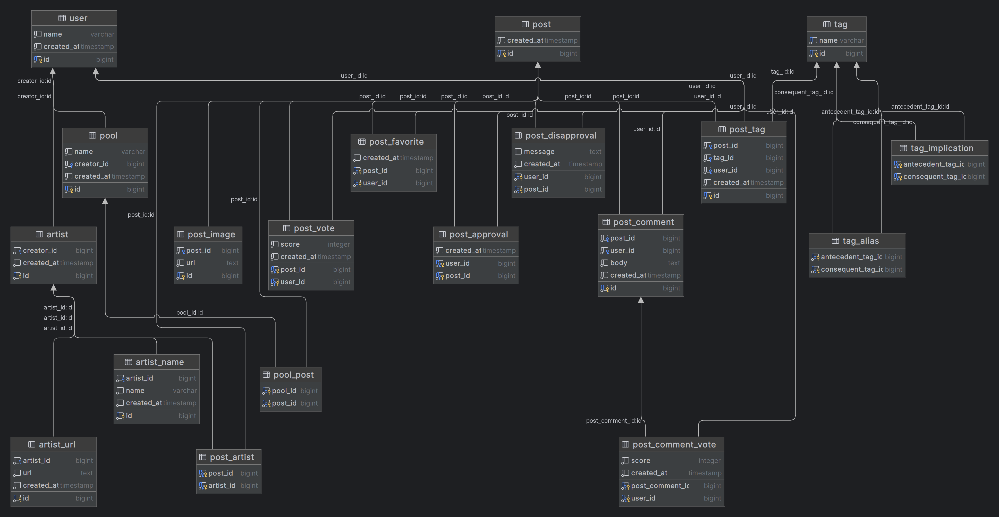

# CS452 Natural Language SQL Project
by Connor Widtfeldt

The CS452 Natural Language SQL Project aims to bridge the gap between natural language questions and SQL queries using AI, specifically leveraging OpenAI's GPT models. This project includes a PostgreSQL database setup, a Python backend for processing and converting natural language into SQL, and a Ruby script for generating mock data to populate the database.

## Purpose

The database serves as the backbone for a fictitious art-sharing website, designed to catalog and enhance the discoverability of art through user-contributed metadata and AI-generated tags. It facilitates a community-driven curation process, allowing users to vote on and favorite artworks, thereby elevating the most appreciated pieces for greater visibility. Additionally, the database supports the organization of artworks into thematic pools, making it easier for users to find and explore art that aligns with their interests. Through its structured schema, the database captures a wide range of information, from artist details to user interactions, ensuring a rich, searchable, and user-friendly repository of digital art and memes.

## Diagram



## Output

**Request:** 

Get all posts (and their score) that have the tag "mountain".
For each post, include the names of the artists who are associated with it.
Sort by score then by creation date.
Limit to the top 5 posts (by score).

**Generated Query:**
```sql
SELECT
    "post"."id",
    SUM("post_vote"."score") AS "score",
    ARRAY_AGG("artist_name"."name") AS "artist_names",
    "post"."created_at"
FROM "post"
INNER JOIN "post_tag" ON "post"."id" = "post_tag"."post_id"
INNER JOIN "tag" ON "post_tag"."tag_id" = "tag"."id"
LEFT JOIN "post_artist" ON "post"."id" = "post_artist"."post_id"
LEFT JOIN "artist" ON "post_artist"."artist_id" = "artist"."id"
LEFT JOIN "artist_name" ON "artist"."id" = "artist_name"."artist_id"
LEFT JOIN "post_vote" ON "post"."id" = "post_vote"."post_id"
WHERE "tag"."name" = 'mountain'
GROUP BY "post"."id"
ORDER BY
    "score" DESC,
    "post"."created_at" ASC
LIMIT 5
```

**Friendly Response:**

Here's a list of the top 5 posts tagged with "mountain" that have received highest scores. Each post is also linked to several artists who contributed to the creation of the post. The list is sorted to feature the posts with the highest score first, and then by the date they were created if scores are the same. For each post, you'll find its identifying number, the total score it received, and the names of all associated artists.

```
┌───────────┬───────┬────────────────────────────────────────────────────────────────────────────┐
│ Post #    │ Score │ Artists                                                                    │
├───────────┼───────┼────────────────────────────────────────────────────────────────────────────┤
│ Post #9   │ 16    │ Kandinsky, Degas, Pissarro, Michelangelo (repeats)                         │
├───────────┼───────┼────────────────────────────────────────────────────────────────────────────┤
│ Post #82  │ 12    │ Renoir, Da Vinci, El Greco, Dali, Picasso, El Greco (repeats)              │
├───────────┼───────┼────────────────────────────────────────────────────────────────────────────┤
│ Post #3   │ 12    │ Rubens, Kandinsky, Edward Hopper, Bernini (repeats)                        │
├───────────┼───────┼────────────────────────────────────────────────────────────────────────────┤
│ Post #99  │ 8     │ Klimt, Titian, Durer, Winslow Homer, Pissarro, Donatello, Bernini, Picasso │
├───────────┼───────┼────────────────────────────────────────────────────────────────────────────┤
│ Post #63  │ 8     │ Manet, Pollock, Joan Miro, Warhol (repeats)                                │
└───────────┴───────┴────────────────────────────────────────────────────────────────────────────┘
```

Summary:
- "Post #9" secured the highest score of 16, with contributions from renowned artists such as Kandinsky, Degas, Pissarro, and Michelangelo.
- Posts #82 and #3 tie with scores of 12, each showcasing works from a diverse group of artists, including the likes of Renoir, Da Vinci, Rubens, and Kandinsky.
- The list concludes with "Post #99" and "Post #63," both striking scores of 8. Among their artists, we see legends such as Klimt, Picasso, Manet, and Pollock.

Each post mentioned is exemplary in its own right, gathering substantial scores and spotlighting the immense talent of their contributing artists.

> See more responses in the [responses](responses) directory.

### Prompting Strategies

When I played around with making different requests to my application, I noticed a couple of interesting things. If I kept my questions simple, like asking for the latest posts, the app spit back simple SQL queries and easy-to-understand answers. But when I started asking for more detailed stuff, like finding the most liked art by artists this month, things got trickier. The SQL it generated was way more complex, with lots of joins and conditions, but it still managed to give me clear responses.

I also saw that being clear and specific in what I asked for made a big difference. The app was really good at digging through the data to find exactly what I wanted, as long as I gave it enough details. And it didn't matter how complicated my requests got—whether I was linking users to their favorite artists or sorting tags by popularity, it handled it like a billiantly.

## Prerequisites

**Note:** This developed on a Ubuntu 22 install. So your mileage may vary.

Before you get started, ensure you have the following installed on your system:

- Docker and Docker Compose
- Python 3.10 or higher
- Ruby 3.0 or higher (for data generation)
- Bundler (for Ruby dependencies)

## Setup

1. **Clone the repository:**

```bash
git clone https://github.com/ConnorWidtfeldt/cs452-natural-language-sql.git
cd cs452-natural-language-sql
```

2. **Environment Variables:**

Create a `.env` file in the root directory with your OpenAI api key and organization id:

```
OPENAI_API_KEY=<your_openai_api_key_here>
OPENAI_ORGANIZATION_ID=<your_openai_organization_id_here>
```

3. **Python Virtual Environment and Dependencies:**

Setup a Python virtual environment and install dependencies:

```bash
python3 -m venv venv
source venv/bin/activate
pip install -r requirements.txt
```

Alternatively you can run `make venv requirements` if you have make installed.

4. **Docker Container for Postgre:**

Launch the Postgre container:

```bash
docker compose up -d
```

5. **Ruby Environment Setup:**

Ensure Bundler is installed and then install Ruby dependencies for data generation:

```bash
bundle install
```

6. **Generate Mock Data:**

Populate the database with mock data:

```bash
ruby generate_data.rb
```
or `make generate_data`

## Usage

After setup, you can run the project to convert natural language questions into SQL queries and execute them against the Postgre database.

```bash
source venv/bin/activate  # If not already activated
python main.py
```

## Project Structure

- [`compose.yaml`](compose.yaml): Docker Compose file for setting up Postgre.
- [`main.py`](main.py): The main Python script interfacing with OpenAI and executing SQL queries.
- [`Makefile`](Makefile): Defines tasks for setting up and running the project.
- [`requirements.txt`](requirements.txt): Python dependencies for the project.
- [`schema.sql`](schema.sql): SQL schema for the database.
- [`generate_data.rb`](generate_data.rb): Ruby script to generate and populate the database with mock data.

## Make Commands

The project comes with a Makefile for convenience:

- `make all`: Runs all setup targets and then runs the main script.
- `make setup`: Prepares the environment, including virtual environment, Docker, and Ruby dependencies.
- `make reset`: Cleans the environment and reruns the setup.
- `make clean`: Removes all components related to the project setup, including Docker containers and the virtual environment.
- `make run`: Executes the main project script.
